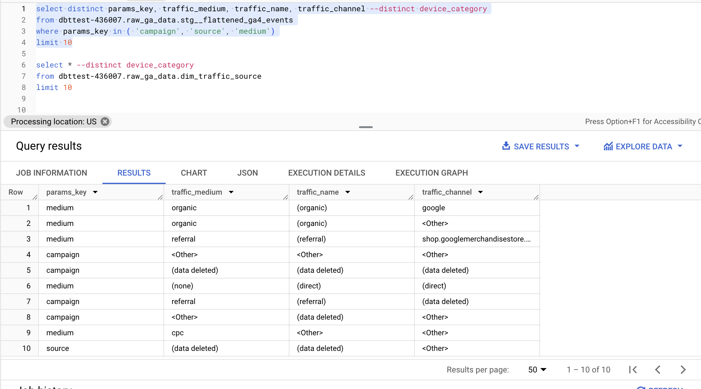
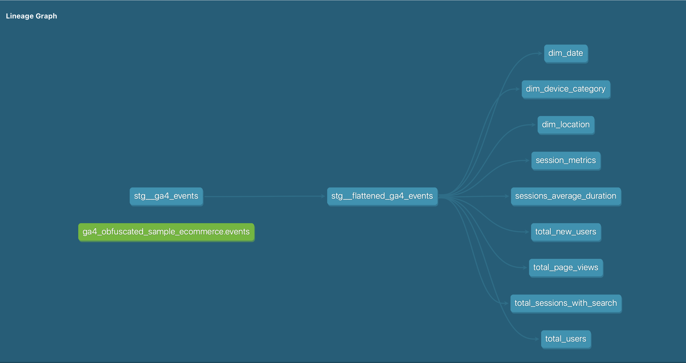

# DBT Project: GA4 Clickstream Analysis

## Project Overview

This project models Google Analytics 4 (GA4) public dataset to provide insights into user interactions on the platform. The goal is to structure the data to generate key metrics and dimensions for session-level analysis.

The key metrics derived in this project include:
- **Total Sessions**
- **Total Users**
- **Total New Users (First Visit)**
- **Total Page Views**
- **Total Sessions with Search**
- **Session Average Duration**

The project is completed in DBT, utilizing BigQuery as the data warehouse. The models are optimized for analytical queries, using star schema modeling principles and best practices for partitioning and clustering where applicable.

## Assumptions

1. **Session Start Key**: `session_start_key` is used to derive session dates.
2. **Traffic Channel Complexity**: The `campaign`, `source`, and `medium` parameters from `event_params` are used to create the `traffic_source` dimension.
Due to the dynamic nature of combinations between these fields, a surrogate key was not introduced, as they don’t represent a slowly changing dimension (SCD).

3. **GA Session ID Duplication**: Duplicate `ga_session_id` values occur due to users potentially using VPNs or other anomalies. As a result, events with duplicate `ga_session_id` in multiple locations are filtered out.
4. **Traffic Channel as Dimension**: Given the potential for a session to occur across multiple locations (due to VPN or other factors), the `traffic_channel` column is not considered a reliable dimension.
5. **Device Categories**: If multiple devices are used within the same session, those sessions are excluded from the analysis.
6. **Partitioning by Event Dates**: The dataset is already partitioned based on `event_date`, optimizing performance for time-based queries.
7. **Session Metrics**: Metrics for sessions are calculated based on only three traffic sources—`campaign`, `source`, and `medium`—as per the requirements.

## Data Warehouse Architecture

The data warehouse follows a Star approach using **DBT** to manage transformations:

## Layers:

### 1. Staging Layer:

This layer extracts raw **GA4** event data and prepares it by flattening nested JSON structures.

#### Key models:
- **stg__ga4_events**: Fetches and stores raw event data from GCP as a view.
- **stg__flattened_ga4_events**: Flattens the nested fields like `event_params` and extracts critical columns like `ga_session_id`, `user_pseudo_id`, `campaign`, and `event_name`.

### 2. Dimension Tables:

These tables provide reference data for slicing and dicing metrics at various granularities.

#### Key dimensions:
- **dim_date**: Contains time-based attributes such as `year`, `month`, and `day`.
- **dim_device_category**: Categorizes devices into `mobile`, `desktop`, `tablet`.
- **dim_location**: Hierarchical geographic data (continent, country, region, city).

### 3. Fact Tables:

These tables store aggregated metrics at the session or user level.

#### Key facts:
- **session_metrics**: Captures session-level aggregates like total users, session duration, and total purchases.
- **total_sessions_with_search**: Stores counts of sessions that include search activity.
- **total_page_views**: Stores the count of page view events.
- **total_new_users**: Counts new users based on first interactions.
- **session_average_duration**: Computes the average session duration across various dimensions.

### Key Optimization Principles:
- **Partitioning**: Data is partitioned based on the event date to ensure efficient querying.
- **Clustering**: The models are designed with key dimensions, such as `device_category` and `geo_location` for optimal performance.
- **Incremental Loads**: `Session_metrics` table use incremental loading to ensure only new data is processed.

### Access and Governance:
- **Access Control**: Role-based access control (RBAC) can be applied to ensure that sensitive information is securely handled. Only authorized personnel can access specific layers of data which can be done via GCp console folllowing the governance principles.

## Session-Level Metrics

The analysis focuses on session-level metrics using `ga_session_id` as the unique key for each session. These metrics are computed in several models that focus on different dimensions such as device category, location, and traffic source.

# Model Breakdown:

## Staging Models:
### `stg__ga4_events`:
- Fetches raw GA4 event data from GCP, creating a view for real-time updates.

### `stg__flattened_ga4_events`:
- A model that flattens and organizes the raw GA4 event data, extracting critical fields like `ga_session_id`, `ga_session_number`, and other relevant parameters for subsequent analysis.

## Dimension Models:
### `dim_date`:
- This model generates a calendar table that helps in aggregating data across different time dimensions like day, month, year, and quarter.

### `dim_device_category`:
- Provides a clean and organized classification of devices used in sessions (e.g., mobile, desktop).

### `dim_location`:
- Captures geographical information, including continent, country, region, and city, for deeper analysis of user behavior across different locations.

## Fact Models:
### `session_metrics`:
- This is an incremental model that captures session-level data. Metrics like total users, total purchases, total events, session duration, and total revenue are calculated for each session.
- Invalid sessions, such as sessions with multiple devices, are excluded.

### `total_users`:
- Aggregates user-level data, grouping by key dimensions such as device category, location, and traffic source. It provides the total count of unique users per session.

### `total_sessions_with_search`:
- Identifies and counts sessions where users performed a search event (e.g., viewing search results). This is useful for understanding how users engage with the platform’s search functionality.

### `total_page_views`:
- Captures the total number of page views for each session, helping to quantify user engagement with the platform’s content.

### `total_new_users`:
- Measures the number of new users (first-time visitors) in each session, based on the `user_first_touch_timestamp` field.

### `session_average_duration`:
- This model calculates the average session duration by aggregating start and end times of each session, giving insights into how long users typically stay engaged with the platform.

   

## Tests

The following tests have been added to ensure data quality and reliability:
- **Not Null**: Critical fields such as `ga_session_id`, `event_date`, `device_category`, and `geo_country` are tested for null values.
- **Unique**: Tests ensure that session identifiers (`ga_session_id`) are unique.
- **Relationships**: Foreign key relationships between fact and dimension tables are validated (e.g., ga_session_id linking to dim_date).
- **Custom Tests**: Validate business logic such as ensuring no negative session durations or ensuring no duplicate sessions.
## Documentation and Investigation

- Full documentation is generated using DBT's in-built documentation feature. It includes detailed descriptions of all models, tables, and fields.
- Screenshots of investigations and key insights from running the models have been captured for reference.

## Service Level Objective (SLO)

- Data should be updated within **24 hours** to maintain timely insights.- this coulde be done using DBT cloud scheduler.
- No duplication of sessions in the final metrics, ensured through filtering and de-duplication logic in the session models.

# Documentation:
- The models have been thoroughly documented using DBT's auto-documentation feature, ensuring clarity on model logic, relationships, and metrics.
- Screenshots of the investigations during the development process are captured to ensure reproducibility and insight sharing.

## Next Steps

1. **Deploy in Production**: Deploy the models with scheduling to run daily for continuous updates.
2. **Expand Analysis**: Expand the analysis by introducing more granular user behavior metrics (e.g., bounce rates, conversion rates).

